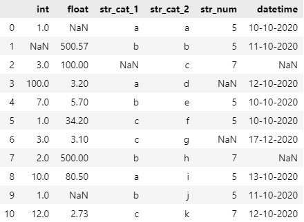

# AutoClean - Automated Data Preprocessing & Cleaning


 
**AutoClean automates data preprocessing & cleaning for your next Data Science project in Python.**

```python
pip install py-AutoClean
```

:thought_balloon: Read more on the AutoClean algorithm in my **Medium** article [Automated Data Cleaning with Python](https://eliselandman.medium.com/automated-data-cleaning-with-python-94d44d854423).

View AutoClean on [PyPi](https://pypi.org/project/py-AutoClean/).

---

## Description
It is commonly known among Data Scientists that data cleaning and preprocessing make up a major part of a data science project. And, you will probably agree with me that it is not the most exciting part of the project. *Wouldn't it be great if this part could be automated?*

:white_check_mark: AutoClean helps you exactly with that: it performs **preprocessing** and **cleaning** of data in Python in an **automated manner**, so that you can **save time** when working on your next project.

AutoClean supports:

:point_right: Handling of **duplicates** **[ NEW with version v1.1.0 ]**  
:point_right: Various imputation methods for **missing values**  
:point_right: Handling of **outliers**  
:point_right: **Encoding** of categorical data (OneHot, Label)  
:point_right: **Extraction** of datatime values  
:point_right: and more!

## Basic Usage

AutoClean takes a **Pandas dataframe as input** and has a built-in logic of how to **automatically** clean and process your data. You can let your dataset run through the default AutoClean pipeline by using:

````python
from AutoClean import AutoClean
pipeline = AutoClean(dataset)
````

The resulting output dataframe can be accessed by using:

````python
pipeline.output

> Output:
    col_1  col_2  ...  col_n
1   data   data   ...  data
2   data   data   ...  data
... ...    ...    ...  ...
````

### Example
As a visual example, the following sample dataset will be passed through the AutoClean pipeline:

<p align="center">
  
</p>

 The output of AutoClean looks as following, whereas the various adjustments have been highlighted:

 <p align="center">
  
</p>

## Adjustable Parameters

In some cases, the default settings of AutoClean might not optimally fit your data. Therefore it also supports **manual settings** so that you can adjust it to whatever processing steps you might need. 

It has the following adjustable parameters, for which the options and descriptions can be found below:

````python
AutoClean(dataset, mode='auto', duplicates=False, missing_num=False, missing_categ=False, 
          encode_categ=False, extract_datetime=False, outliers=False, outlier_param=1.5, 
          logfile=True, verbose=False)
````

| Parameter | Type | Default Value | Other Values |
| ------ | :---: | :---: | ------ | 
| mode | `str` | `'auto'` | `'manual'` |
| duplicates | `str` | `False` | `'auto'`, `True` |
| missing_num | `str` | `False` | `'auto'`, `'linreg'`, `'knn'`, `'mean'`, `'median'`, `'most_frequent'`, `'delete'`, `False` |
| missing_categ | `str` | `False` | `'auto'`, `'logreg'`, `'knn'`, `'most_frequent'`, `'delete'`, `False` |
| encode_categ | `list` | `False` | `'auto'`, `['onehot']`, `['label']`, `False` ; to encode only specific columns add a list of column names or indexes: `['auto', ['col1', 2]]` |
| extract_datetime | `str` | `False` | `'auto'`, `'D'`, `'M'`, `'Y'`, `'h'`, `'m'`, `'s'` |
| outliers | `str` | `False` | `'auto'`, `'winz'`, `'delete'`|
| outlier_param | `int`, `float` | `1.5` | any int or float, `False` |
| logfile | `bool` | `True` | `False` |
| verbose | `bool` | `False` | `True` |

### mode

**[ NEW ] with version v1.1.0**

Defines in which mode AutoClean will run:

* Automated processing (`mode` = `'auto'`): the data will be analyzed and cleaned automatically, by being passed through all the steps in the pipeline. All the parameters are set to = `'auto'`.
* Manual processing (`mode` = `'manual'`): you can manually define the processing steps that AutoClean will perform. All the parameters are set to `False`, except the ones that you define individually.

For example, you can choose to only handle outliers in your data, and skip all other processing steps by using:

```python
pipeline = AutoClean(dataset, mode='manual', outliers='auto')
```
### duplicates

**[ NEW ] with version v1.1.0**

Defines whether AutoClean should handle **duplicate** values in the data. If set to `'auto'` or `True`, AutoClean will delete the rows it found which are exacte duplicates on all features. Set duplicates to `False` if you want to skip this step.

### missing_num

Defines how **numerical** missing values in the data are handled. Missing values can be predicted, imputed or deleted. When set to `auto`, AutoClean first attempts to predict the missing values with **Linear Regression**, and the values that could not be predicted are **imputed with K-NN**.

You can specify the handling method by setting `missing_num` to: `'linreg'`, `'knn'`, `'mean'`, `'median'`, `'most_frequent'`, `'delete'` or to `False` if you want to skip this step.

### missing_categ

Defines how **categorical** missing values in the data are handled. Missing values can be predicted, imputed or deleted. When set to `auto`, AutoClean first attempts to predict the missing values with **Logistic Regression**, and the values that could not be predicted are **imputed with K-NN**.

You can specify the handling method by setting `missing_categ` to: `'logreg'`, `'knn'`, `'most_frequent'`, `'delete'` or to `False` if you want to skip this step.

### encode_categ

Defines how **categorical** values should be encoded. Categorical values can be onehot- or label-encoded. 

The parameter must be handed as Python `list` type. When set to `['auto']`, AutoClean:

* onehot-encodes features that have **less than 10 unique data values**
* label-encodes features that have **less than 20 unique data values**
* does not encode feature having **more than 20 unqiue data values**

You can specify the encoding method manually by setting `encode_categ` to `['onehot']` or `['label']`. By default, AutoClean will encode all categorical features. You can specify which features to encode by giving the column names or indexes as parameter, for example  `['onehot', ['column_1', 2]]` - this will onehot-encode the column with column name 'column_1' and the column with index '2'.

Set `encode_categ` to `False` to skip categorical encoding.

### extract_datetime

AutoClean can search the data for datetime features, and **extract** the values to separate columns. When set to `'s'`, it extracts the datetime values up to the seconds i. e. day, month, year, hour, minutes, seconds.

You can set the granularity of the extraction manually by setting `extract_datetime` to `'D'` for day, `'M'` for month, `'Y'` for year, `'h'` for hour, `'m'` for minutes or to `False` if you want to skip this step. 

### outliers

Defines how **outliers** in the data are handled. Outliers can be manipulated with two different methods: winsorization or deletion. You can specfiy the method by setting `'outliers'` to `'winz'` for winzorization, `'delete'` for deletion or to `False` if you want to skip this step.

*When are outliers considered to be outliers?*  
Oberservations are considered outliers if they are outside the following bounds:

````python
[Q1 - 1.5*IQR , Q3 + 1.5*IQR]
````
where  
... Q1 and Q3 are the first and third quartile of the feature values  
... IQR is the interquartile range of the feature values

As soon as a value is below the lower or upper bound, the chosen outlier handling method is applied i. e. either winsorization, meaning it will be replaced by the respective lower or upper bound, or the observation will be deleted.

You can **customize** the outlier bounds by changing the default `outlier_param` value of `1.5` to any integer or float of your choice. **It is not recommended to change the `outlier_param` value!**

### outlier_param

! Recommended not to change default value

You can **customize** the outlier bounds by changing the default `outlier_param` value of `1.5` to any integer or float of your choice. **It is not recommended to change the `outlier_param` value!**

### logfile

Defines whether a logfile should be generated while the AutoClean process runs. If set to `True`, it will create a `autoclean.log` file in your current working directory.

You can view a [sample logfile here](https://github.com/elisemercury/AutoClean/blob/main/autoclean/autoclean.log).

### verbose

Defined whether the logfile output should be shown on the console while the AutoClean process runs. Set to `True` if you want to follow the process logs in real-time.
