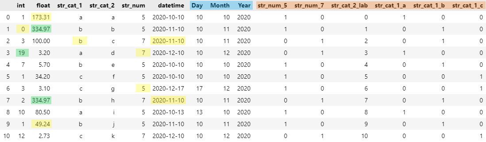

# AutoClean


**Python Package for Automated Dataset Preprocessing & Cleaning**

```python
pip install py-AutoClean
```

:thought_balloon: Read more on how the algorithm of AutoClean works in my Medium article [Automated Data Cleaning with Python](link).

## Description
It is commonly known among Data Scientists that data cleaning and preprocessing make up a major part of a data science project. And, in all honesty, on average it is not the most exciting part of the project.

:white_check_mark: AutoClean helps you **save time** in major parts of these tasks and performs **preprocessing** in an **automated manner**!

AutoClean supports:

:point_right: Various imputation methods for **missing values**  
:point_right: Handling of **outliers**  
:point_right: **Encoding** of categorical data (OneHot, Label)  
:point_right: **Extraction** of datatime values  
:point_right: and more!

As an example, the following sample dataset will be passed through the AutoClean pipeline:

<p align="center">
  
</p>

 The output of AutoClean looks as following, whereas the various adjustments have been highlighted:

 <p align="center">
  
</p>

## Basic Usage

````python
from AutoClean import AutoClean
pipeline = AutoClean(dataset)
````

## Adjustable Parameters

AutoClean has the following adjustable parameters:

````python
AutoClean(dataset, missing_num='auto', missing_categ='auto', encode_categ=['auto'], extract_datetime='s', outliers='winz', outlier_param=1.5, logfile=True, verbose=False)
````

| Parameter &nbsp-s | Type &nbsp-s | Default Value &nbsp-s | Other Values |
| ------ | :---: | :---: | ------ | 
| missing_num | `str` | `'auto'` | `linreg`, `knn`, `mean`, `median`, `most_frequent`, `delete` |
| missing_categ | `str` | `'auto'` | `logreg`, `knn`, `most_frequent`, `delete` |
| missing_categ | `list` | `['auto']` | `['onehot']`, `['label']`; to encode only specific columns add a list of column names or indexes: `['auto', ['col1', 2]]` |
| extract_datetime | `str` | `'s'` | `D`, `M`, `Y`, `h`, `m` |
| outliers | `str` | `'winz'` | `delete`|
| outlier_param | `int`, `float` | `1.5` | any int or float |
| logfile | `bool` | `True` | `False` |
| verbose | `bool` | `True` | `False` |


